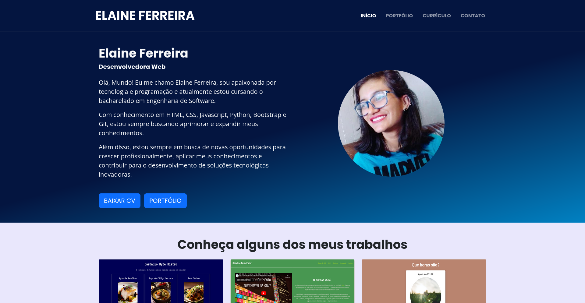

<h1 align="center">Portfólio Pessoal</h1>

<h2 align="center">

<a href="https://elainefs.github.io/" target="_blank">Ver Projeto</a>
</h2>

  
  
  
  

## 📘 Sobre

Portfólio pessoal desenvolvido utilizando HTML5, CSS3, Javascript e Bootstrap com o objetivo de expor minhas habilidades, contatos e projetos desenvolvidos.

## 💻 Tecnologias

- HTML5
- CSS3
- Bootstrap
- JavaScript

## 📄 Licença

Este projeto está sob a licença MIT. Consulte o arquivo [LICENSE](/LICENSE) para obter mais detalhes.

Made with ❤️ by [Elaine Ferreira](https://github.com/elainefs)
